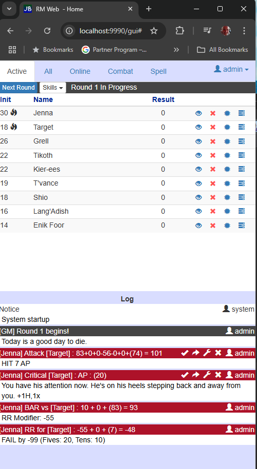
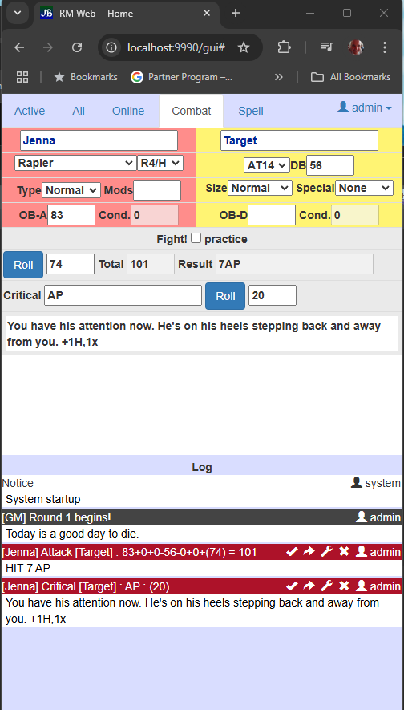

# RMWeb

RMWeb is a Rolemaster Standard Rules web application that allows a group of rolemaster players to share a common
view of players and visible NPCs, manage initiative, role skill checks, and resolve combat using full weapon
and critical table look-ups.

The application is design to be shrunk to min-width in its own window and run as a side-bar for some other TTRPG
integration like Role20 or the like, which don't offer clean support.

The tables were scraped, hand cut/pasted through group-sourced labor, and the contents of those tables are likely
only fair-use if you own Arms Law and Spell Law.



## How To Run

The release content is a runnable JAR file, meaning download and double click to run.  It does create data in
the folder it runs from and has a local database to save entities.  One running, it is a web app that can be
accessed using http://localhost:9990/gui.  Offsite players will require port forwarding and your public IP address.

### Command Line

Save the jar file in a directory nameed RMWeb.

```
cd RMWeb
java -jar RMWeb.jar
```

## Setup

Admin should login first, as the first person to create an account IS the database and site administrator.  After that,
admin may use the Settings menu to adjust whether players require passwords and accounts to join, or if they can join
using only their name.
